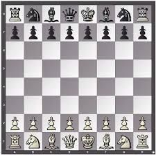
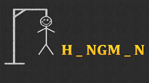

Portfolio
=========

Programming Projects
--------------------

*For access to my private project repositories, please [email me](mailto:lareed@csustudent.net?subject=GitHub%20Access) with the subject line, GitHub Access.

---
### [Chess Game Final Project | CSCI 325](project1)

---
### [Hangman | CSCI 301](project2)

---
### [Chat Room | CSCI 332](project3)

---
### [Disk Drive Calculator | CSCI 301](project4)

---

Ethics Papers
-------------

### [App Notifications Ethics Paper](/pdf/App_Notifications_Ethics_Paper.pdf)

-   **Class:** CSCI 235
-   **Grade:** B

### [Net Neutrality Ethics Paper](/pdf/Net_Neutrality_Ethics_Paper.pdf)

-   **Class:** CSCI 332
-   **Grade:** A

### [AI Ethics Paper](/pdf/AI_Ethics_Paper.pdf)

-   **Class:** CSCI 301
-   **Grade:** C

---

Presentations
-------------

### <a href="https://www.youtube.com/watch?v=tW3CPtU0QLA">Chat Room Presentation

- **Class:** 
- **Grade:**

### [Presentation 2 Title](/pdf/sample_presentation.pdf)

- **Class:** 
- **Grade:**

---

Page template forked from <a href="https://github.com/csu-cs/csci-portfolio">CSU-CS</a>

<!-- Remove above link if you don't want to attributive -->
