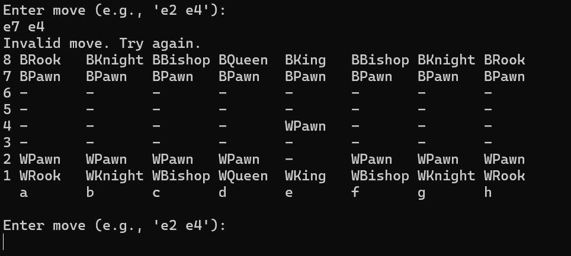
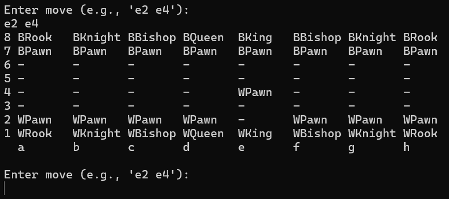
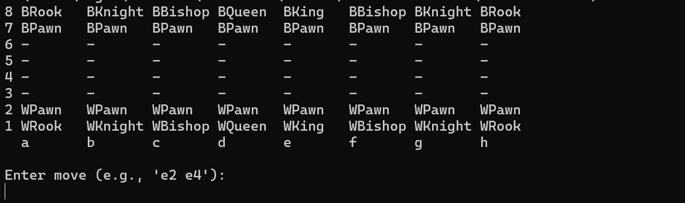

[Back to Portfolio](./)

Chess Game Final Project
===============

-   **Class:** CSCI 325
-   **Grade:** B
-   **Language(s):** Java
-   **Source Code Repository:** [features/mastering-markdown](https://guides.github.com/features/mastering-markdown/)  
    (Please [email me](mailto:lareed@csustudent.net?subject=GitHub%20Access) to request access.)

## Project description

Myself and a few other tried to recreate the popular game chess. We planned on having a interactive graphic user interface but ran into problems during creation. We settled for formatting a string into a chess board design.

## How to compile and run the program

```bash
cd ./project
javac ChessGame.java
java ChessGame
```

## UI Design

Upon using the command "java ChessGame" the command line will print the main chess board at the beginning of the game (see Fig 1). Once you are in you can type the board coordinate of the piece you want to use and then the board coordinate of where you want to move that piece (see Fig 2). If it is not your turn or you move the piece somewhere it can't go then you will get a message saying "Invalid move." and will have to try again (see Fig 3).

  
Fig 1. Program upon loading.

  
Fig 2. Program after a successful move.

  
Fig 3. Program after an invalid move.

For more details see [GitHub Flavored Markdown](https://guides.github.com/features/mastering-markdown/).

[Back to Portfolio](./)
