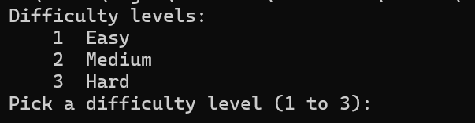
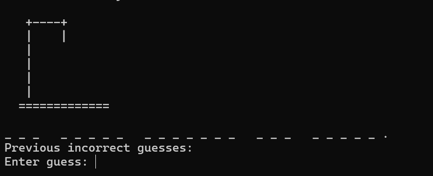
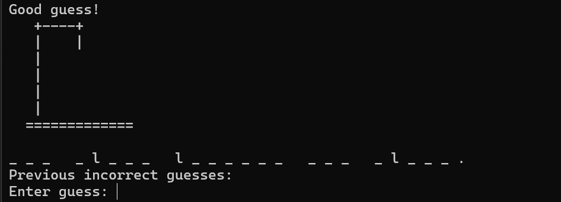
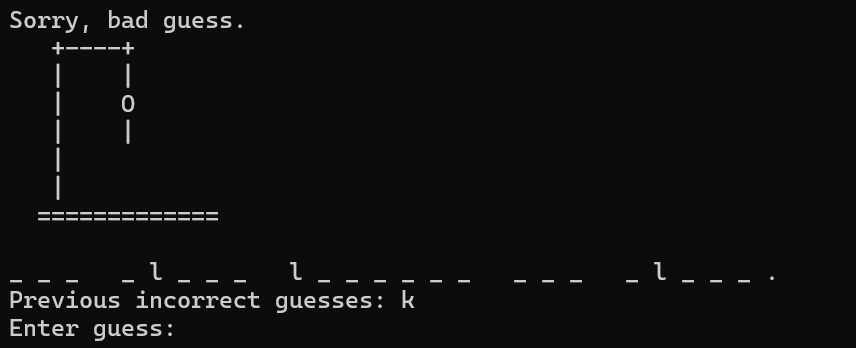
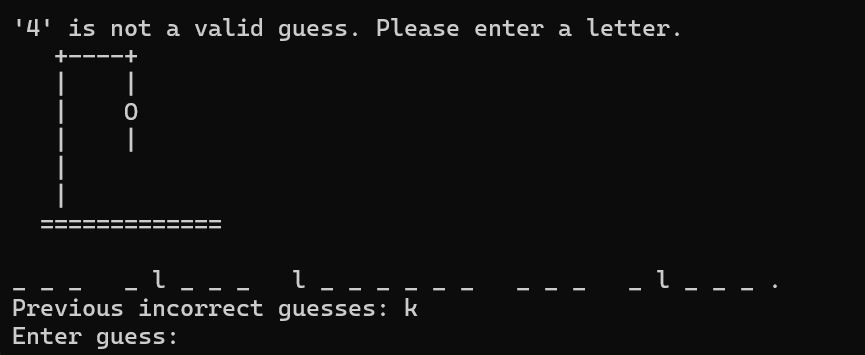

[Back to Portfolio](./)

Hangman
===============

-   **Class:** CSCI 301
-   **Grade:** C
-   **Language(s):** C++
-   **Source Code Repository:** [features/mastering-markdown](https://guides.github.com/features/mastering-markdown/)  
    (Please [email me](mailto:lareed@csustudent.net?subject=GitHub%20Access) to request access.)

## Project description

Classic Hangman game that I recreated. The code works very well with multiple difficulties and phrases.

## How to compile and run the program

```bash
cd ./project
g++ Hangman.cpp
Hangman.exe
```

## UI Design

Upon loading into the program you are asked to select a difficulty (see Fig 1). Once you select a difficulty you are brought to a blank hangman game and it asks for a letter (see Fig 2). If you input a correct letter it fills out the spots where that letter goes in the phrase (see Fig 3). If you input a wrong letter the man starts to form on the gallows and it lists the letter you got wrong (see Fig 4). If you input something other than a letter you get a message telling you it is invalid (see Fig 5).

  
Fig 1. Program asks for difficulty upon launch.

  
Fig 2. Program forms an empty gallows and phrase equivelant to your difficulty.

  
Fig 3. Correct letter was typed.

  
Fig 4. Incorrect letter was typed.

  
Fig 5. Invalid character was typed.

For more details see [GitHub Flavored Markdown](https://guides.github.com/features/mastering-markdown/).

[Back to Portfolio](./)
