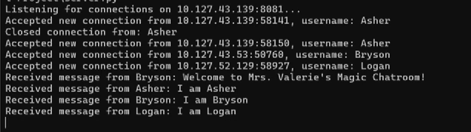
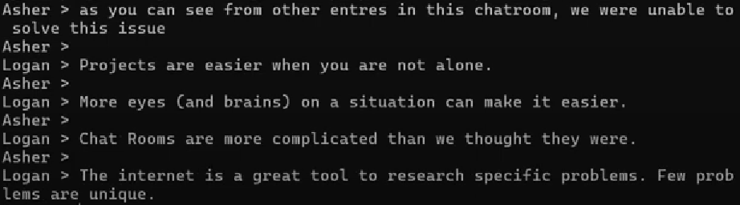

[Back to Portfolio](./)

Chat Room
===============

-   **Class:** CSCI 332
-   **Grade:** A
-   **Language(s):** Python
-   **Source Code Repository:** [features/mastering-markdown](https://guides.github.com/features/mastering-markdown/)  
    (Please [email me](mailto:lareed@csustudent.net?subject=GitHub%20Access) to request access.)

## Project description

A live chat room with a client side and a server side that me and two others created. The server would be launched first then the clients would join after.

## How to run the program

```bash
cd ./project
python Server.py
python Client.py
```

## UI Design

Upon loading the client side it asks for your username (see Fig 1). Afterwards on the server side you can see people connecting to the chat room and any messages anyone sends (see Fig 2). On the client side you can see your messages and others (see Fig 3).

  
Fig 1. Client side launch.

  
Fig 2. Others connecting and sending messages on the server side.

  
Fig 3. Incoming and outgoing client side messages.

For more details see [GitHub Flavored Markdown](https://guides.github.com/features/mastering-markdown/).

[Back to Portfolio](./)
