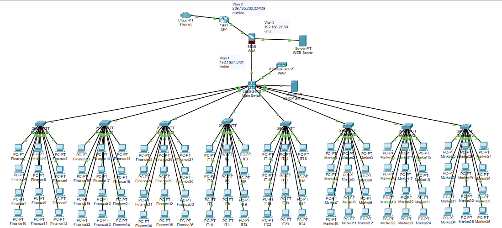

[Back to Portfolio](./)

Senior Project
===============

- <a href="github.com/MilitarizedCat/Senior-Project-All-Documents"> Lab Repository

## Project description

This is the project I did as the capstone project for my Senior graduation. It is a lab that guides the user on how to use Cisco Packet Tracer to create and secure a small network. 

## How to Use

Download these files from the repository and follow the lab:

- Lab Instructions.pdf
- Starting Network.pkt

## Project documentation

- <a href="https://github.com/MilitarizedCat/Senior-Project-All-Documents/blob/main/documentation/Senior_Project_Testing_Plan.pdf"> Test Plan
- <a href="https://github.com/MilitarizedCat/Senior-Project-All-Documents/blob/main/documentation/Senior%20Project%20Creation%20Documentation.pdf"> Creation Documentation  
- <a href="https://github.com/MilitarizedCat/Senior-Project-All-Documents/blob/main/documentation/Senior%20Project%20Proposal.pdf"> Senior Proposal

[Back to Portfolio](./)
