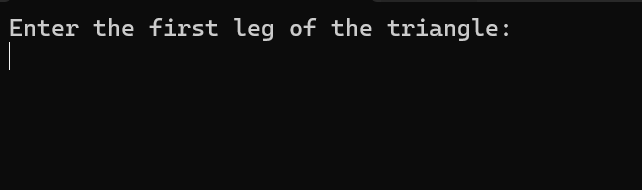

[Back to Portfolio](./)

Disk Drive Calculator
===============

-   **Class:** CSCI 301
-   **Grade:** C
-   **Language(s):** Java
-   **Source Code Repository:** [features/mastering-markdown](https://guides.github.com/features/mastering-markdown/)  
    (Please [email me](mailto:lareed@csustudent.net?subject=GitHub%20Access) to request access.)

## Project description

Place holder program that calculates how much free disk space you have on your system. Once I get a better program it will be placed here.

## How to compile and run the program

```bash
cd ./project
javac JavaCalculator.java
java JavaCalculator
```

## UI Design

Almost every program requires user interaction, even command-line programs. Include in this section the tasks the user can complete and what the program does. You don't need to include how it works here; that information may go in the project description or in an additional section, depending on its significance.

Program displays how much disk space you have after loading it (see Fig 1).

  
Fig 1. Disk space displayed.

For more details see [GitHub Flavored Markdown](https://guides.github.com/features/mastering-markdown/).

[Back to Portfolio](./)
